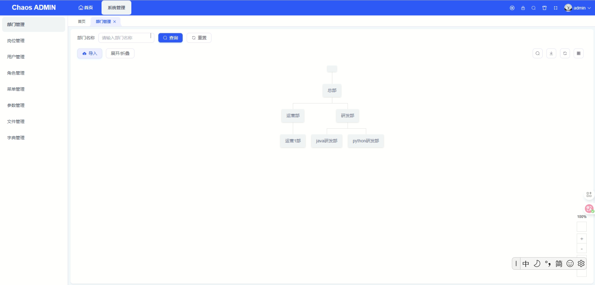
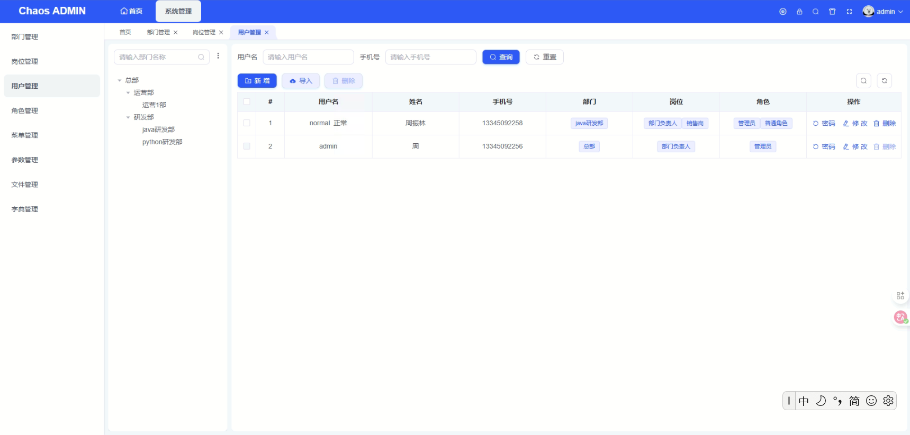

### chaos(混沌) 介绍

Chaos（混沌）是一个现代化的简单‘简洁后端开发框架，框架采用当前主流的技术栈，经过精心设计和优化，旨在解决传统框架在代码混乱等方面的痛点，致力于为开发者提供快速、简单易懂的后端系统开发解决方案。。






### 内置功能

------

- 部门管理：配置系统组织机构（公司、部门、小组），树结构展现，可随意调整上下级

- 用户管理：用户是系统操作者，该功能主要完成系统用户配置。

- 角色管理：角色菜单权限分配、设置角色按部门进行数据范围权限划分。

- 数据过滤：按部门进行数据权限划分，可以限制每个人的访问数据权限。

- 菜单管理：配置系统菜单，操作权限，按钮权限标识等。

- 字典管理：对系统中经常使用的一些较为固定的数据进行维护，如：是否、男女、类别、级别等。

- 参数管理：对系统中的配置信息进行管理

- 日志管理


因其他项目打扰，还有一些功能逐步完善，代码非常简洁。


### 核心依赖


前端Vue3

| 依赖 | 版本 |说明|
| ----------- | ---- |-----|
| Node | 16+ |
| Vue          | 3.5.13 |
| Element Plus   | 2.5.5 |

后端API

| 依赖           | 版本     | 说明     |
|--------------|--------|--------|
| Spring Boot  | 4.0.0 ||
| Mybatis Plus | 3.5.15 ||
| Sa-Token     | 1.44.0 ||
| Hutool       | 5.8.38  ||
| JDK          | 17.0+   ||
| MySQL        | 8.0+   ||
| Maven        | 3.5+   |       |
| IDEA         | 2025+  | 	需要安装 lombok 插件       |


### 运行步骤

#### 前端系统
```
1.克隆项目

2.npm install

3.npm run dev

4.打包发布 npm run build
```

#### 后端系统
```
1.克隆项目

2.导入数据库 ：新建数据库名：chaos_dev，然后将项目目录/chaos-api/doc/chaos_dev.sql导入到数据库中，

3.运行项目

4.登录 用户名：admin 密码：123456
```


##### 其他说明

1. 联系作者:13345092258(微信同号)
2. 如果对这个项目刚兴趣，欢迎提交 [PR]()


